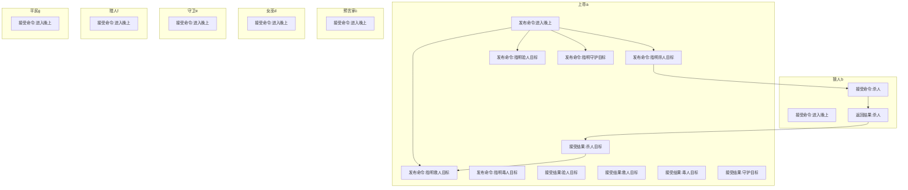

1. 游戏结束后可以给参加游戏的人进行大赏，系统和个人分成。

```mermaid
graph TB
         subgraph 上帝a
         a1[发布命令:进入晚上]
         a2[发布命令:指明杀人目标]
         a3[发布命令:指明验人目标]
         a4[发布命令:指明救人目标]
         a5[发布命令:指明毒人目标]
         a6[发布命令:指明守护目标]
         a7[接受结果:杀人目标]
         a8[接受结果:验人目标]
         a9[接受结果:救人目标]
         a10[接受结果:毒人目标]
         a11[接受结果:守护目标]
         a1-->a2
         a1-->a3
         a1-->a4
         a1-->a6
         a7-->a4
         end
         subgraph 狼人b
         b1[接受命令:进入晚上]
         b2[接受命令:杀人]
         b3[返回结果:杀人]
         b2-->b3
         b3-->a7
         end
         subgraph 预言家c
         c1[接受命令:进入晚上]
         end
         subgraph 女巫d
         d1[接受命令:进入晚上]
         end
         subgraph 守卫e
         e1[接受命令:进入晚上]
         end
         subgraph 猎人f
         f1[接受命令:进入晚上]
         end
         subgraph 平民g
         g1[接受命令:进入晚上]
         end
         a2-->b2
```

