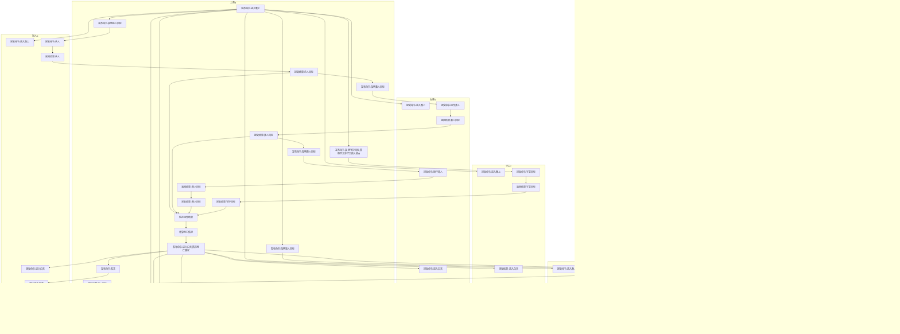

1. 游戏结束后可以给参加游戏的人进行大赏，系统和个人分成。
2. 守卫连续两晚不能守卫同一个人

```mermaid
graph TB
         subgraph 上帝a
         a1[发布命令:进入晚上]
         a2[发布命令:指明杀人目标]
         a3[发布命令:指明验人目标]
         a4[发布命令:指明救人目标]
         a5[发布命令:指明毒人目标]
         a6[发布命令:指明守护目标,携带不允许守卫的人的id]
         a7[接受结果:杀人目标]
         a8[接受结果:验人目标]
         a9[接受结果:救人目标]
         a10[接受结果:毒人目标]
         a11[接受结果:守护目标]
         a12[暂存操作结果]
         a13[计算死亡情况]
         a14[发布命令:进入白天,携带死亡情况]
         a15[发布命令:验人结果]
         a16[发布命令:发言]
         a17[发布命令:当前发言人是某人]
         a17[接受命令:发言内容]
         a18[接受命令:发言结束]
         a1-->a2
         a1-->a3
         a1-->a6
         a7-->a4
         a9-->a5
         d5-->a10
         a7-->a12
         a9-->a12
         a10-->a12
         a12-->a13
         a13-->a14
         a8-->a15
         a11-->a12
         a14-->a16
         end
         subgraph 狼人b
         b1[接受命令:进入晚上]
         b2[接受命令:杀人]
         b3[返回结果:杀人]
         b4[接受命令:进入白天]
         b5[进行操作:发言]
         b6[发布结果:发言结束]
         a1-->b1
         a2-->b2
         b2-->b3
         b3-->a7
         a14-->b4 
         a16-->b5
         b5-->a17
         b5-->b6
         b6-->a18
         end
         subgraph 预言家c
         c1[接受命令:进入晚上]
         c2[接受命令:操作验人]
         c3[接受命令:获取验人结果]
         c4[接受命令:进入白天]
         c5[接受命令:其他人发言内容]
         a1-->c1
         a3-->c2
         c2-->a8
         a15-->c3
         a14-->c4
         a17-->c5
         end
         subgraph 女巫d
         d1[接受命令:进入晚上]
         d2[接受命令:操作救人]
         d3[返回结果:救人目标]
         d4[接受命令:操作毒人]
         d5[返回结果:毒人目标]
         d6[接受命令:进入白天]
         d7[接受命令:其他人发言内容]
         a1-->d1
         a4-->d2
         d2-->d3
         d3-->a9
         d4-->d5
         a5-->d4
         a14-->d6
         a17-->d7
         end
         subgraph 猎人e
         e1[接受命令:进入晚上]
         e2[接受命令:进入白天]
         e3[接受命令:其他人发言内容]
         a1-->e1
         a14-->e2
         a17-->e3
         end
         subgraph 守卫f
         f1[接受命令:进入晚上]
         f2[接受命令:守卫目标]
         f3[返回结果:守卫目标]
         f4[接受结果:进入白天]
         f5[接受命令:其他人发言内容]
         a1-->f1
         a6-->f2
         f2-->f3
         f3-->a11
         a14-->f4
         a17-->f5
         end
         subgraph 平民g
         g1[接受命令:进入晚上]
         g2[接受命令:进入白天]
         g3[接受命令:其他人发言内容]
         a1-->g1
         a14-->g2
         a17-->g3
         end
```

